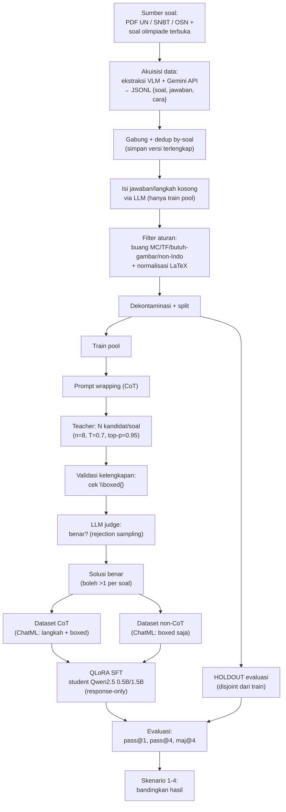

# PENGARUH CHAIN-OF-THOUGHT TERHADAP PENALARAN MATEMATIKA LLM
### Laporan Akhir — Final Project NLP, Kelompok 5

> **Status dokumen:** Bab I–III terisi. **Bab IV (Hasil dan Pembahasan)** dan **Bab V (Kesimpulan
> dan Saran)** ditunda sampai eksperimen selesai (placeholder berstruktur tersedia di bawah).
>
> **Tanda dalam dokumen:**
> `KONFIRMASI` = perlu dikonfirmasi ke anggota tim (terutama akuisisi data & teacher model).
> `VERIFIKASI SITASI` = field APA (halaman/DOI/venue) perlu dicek ulang ke sumber asli sebelum
> dikumpulkan — lihat catatan Daftar Pustaka.

---

## BAB I — PENDAHULUAN

### 1.1 Latar Belakang

Matematika merupakan salah satu kompetensi inti dalam sistem pendidikan Indonesia. Kemampuan ini
diuji secara berjenjang melalui asesmen nasional, seleksi masuk perguruan tinggi (SNBT), hingga
ajang kompetisi seperti Olimpiade Sains Nasional (OSN/KSN). Di sisi lain, banyak peserta didik
menghadapi kesulitan dalam penalaran matematis dan keterbatasan akses terhadap pendampingan
belajar yang terjangkau. Dalam beberapa tahun terakhir, model bahasa besar (*Large Language Model*,
LLM) berkembang pesat dan mulai dimanfaatkan sebagai alat bantu belajar, termasuk untuk
menyelesaikan dan menjelaskan soal matematika. Hal ini membuka peluang menghadirkan tutor digital
yang dapat menalar langkah demi langkah.

Namun, kemampuan penalaran matematis LLM tidak muncul secara cuma-cuma. Penelitian menunjukkan
bahwa LLM baru menalar dengan baik bila didorong menuliskan langkah penyelesaian secara eksplisit
melalui *chain-of-thought* (CoT) *prompting* (Wei et al., 2022), bahkan hanya dengan instruksi
sederhana "mari berpikir langkah demi langkah" (Kojima et al., 2022). Persoalannya, efek CoT yang
kuat ini awalnya hanya teramati pada model berukuran sangat besar (puluhan hingga ratusan miliar
parameter) (Wei et al., 2022; Lewkowycz et al., 2022) — model yang mahal dijalankan dan tidak
praktis untuk diterapkan secara luas di lingkungan dengan sumber daya terbatas seperti sekolah di
Indonesia.

Untuk mengatasi keterbatasan tersebut, arah penelitian bergeser dari sekadar *prompting* pada
model raksasa menuju **transfer kemampuan penalaran ke model kecil melalui *knowledge
distillation***: model *teacher* yang kuat membangkitkan jejak penalaran CoT, lalu jejak tersebut
dipakai melatih model *student* yang lebih ringkas (DeepSeek-AI et al., 2025). Perkembangan
mutakhir menyempurnakan pendekatan ini dengan **sintesis data berbasis *rejection sampling***:
*teacher* membangkitkan banyak kandidat solusi per soal, kemudian hanya solusi yang formatnya
lengkap dan jawabannya benar yang dipertahankan sebagai data latih, sebagaimana terbukti efektif
pada dataset OpenMathReasoning yang menjadi fondasi solusi pemenang kompetisi AIMO-2 (Gitman et
al., 2025). Pendekatan ini lebih unggul dibanding distilasi naif karena menjamin mutu data latih
melalui penyaringan kebenaran, bukan sekadar meniru keluaran *teacher* apa adanya.

Meskipun demikian, hampir seluruh upaya tersebut berpusat pada Bahasa Inggris (Hendrycks et al.,
2021; Toshniwal et al., 2024; Gitman et al., 2025). Model multibahasa seperti Qwen2.5 memang dapat
menyelesaikan sebagian soal matematika Indonesia secara *zero-shot*, tetapi kerap keliru memahami
kosakata, struktur soal, dan konvensi format jawaban kurikulum Indonesia. Sementara itu,
efektivitas distilasi-CoT pada **Bahasa Indonesia** dengan **model *student* berukuran sangat
kecil (0.5B–1.5B parameter)** masih belum banyak dieksplorasi — padahal justru kombinasi inilah
yang relevan secara praktis untuk penerapan lokal yang murah.

Berdasarkan kesenjangan tersebut, penelitian ini membangun model bahasa Indonesia berukuran kecil
untuk penalaran matematis dengan mereplikasi-secara-mini resep distilasi-CoT AIMO-2. Solusi yang
ditawarkan berupa *pipeline* menyeluruh: (1) mengakuisisi dan membersihkan soal matematika
berbahasa Indonesia; (2) mensintesis solusi CoT berbahasa Indonesia menggunakan *teacher model*
dengan penyaringan *rejection sampling*; (3) melatih model *student* Qwen2.5 (0.5B/1.5B) secara
hemat sumber daya dengan QLoRA; dan (4) mengevaluasi peningkatan kemampuan penalaran secara
terkontrol (CoT vs non-CoT) dan terhadap model *baseline*. Dengan demikian, penelitian ini
diharapkan memberi kontribusi teoretis mengenai efektivitas *knowledge distillation* via CoT pada
bahasa non-Inggris dengan model kecil, sekaligus kontribusi praktis berupa model ringan dan
*pipeline* yang dapat diadaptasi untuk mendukung pembelajaran matematika di Indonesia.

### 1.2 Rumusan Masalah

1. Bagaimana membangun dataset soal matematika berbahasa Indonesia yang bersih dan bebas
   duplikasi melalui proses ekstraksi dan penyaringan?
2. Bagaimana menghasilkan solusi *Chain-of-Thought* (CoT) berkualitas tinggi untuk setiap soal
   menggunakan *teacher model*, dan seberapa besar proporsi solusi yang lolos validasi format
   maupun kebenaran jawaban?
3. Apakah *fine-tuning* model Qwen2.5 (0.5B/1.5B) menggunakan data CoT hasil distilasi dapat
   meningkatkan kemampuan penalaran matematika dalam Bahasa Indonesia dibandingkan model
   *baseline* tanpa *fine-tuning*?
4. Seberapa baik performa model hasil *fine-tuning* ketika dievaluasi pada metrik pass@1, pass@4,
   dan maj@4?

### 1.3 Tujuan Penelitian

1. Membangun dataset soal matematika berbahasa Indonesia yang bersih dan bebas duplikasi.
2. Menghasilkan pasangan soal–solusi *Chain-of-Thought* (CoT) terverifikasi sebagai data latih.
3. Melatih model Qwen2.5 (0.5B/1.5B) menggunakan data CoT yang dihasilkan dan mengukur
   peningkatan kemampuan penalaran matematika dalam Bahasa Indonesia dibandingkan *baseline*.
4. Membandingkan performa model sebelum dan sesudah *fine-tuning* pada metrik yang ditetapkan.

### 1.4 Manfaat Penelitian

**Manfaat Teoretis**
1. Memberikan kontribusi dataset soal matematika berbahasa Indonesia untuk penelitian selanjutnya.
2. Menambah pemahaman mengenai efektivitas *knowledge distillation* via CoT ketika diterapkan
   pada bahasa selain Inggris dengan model kecil.

**Manfaat Praktis**
1. Menghasilkan model berukuran kecil yang mampu menyelesaikan soal matematika berbahasa Indonesia.
2. Menyediakan *pipeline* yang dapat diadaptasi oleh peneliti lain untuk keperluan serupa.

### 1.5 Batasan Masalah

1. Domain soal dibatasi pada matematika tingkat SMA dan kompetisi (UN/SNBT/OSN serta soal bertipe
   olimpiade dari sumber terbuka).
2. Model *student* dibatasi pada keluarga Qwen2.5 ukuran kecil (0.5B dan 1.5B parameter) dengan
   *fine-tuning* hemat parameter (QLoRA).
3. *Teacher model* dan *judge* mengikuti ketersediaan komputasi (Bab III); kualitas distilasi
   dibatasi kapasitas *teacher* tersebut.
4. Evaluasi dilakukan pada *holdout* internal, bukan pada kompetisi atau *benchmark* eksternal
   berlisensi.

---

## BAB II — TINJAUAN PUSTAKA

### 2.1 Penelitian Terdahulu dan Analisis Kesenjangan

| Penelitian | Fokus | Kesenjangan terhadap penelitian ini |
|---|---|---|
| Hendrycks et al. (2021) | *Benchmark* MATH untuk evaluasi penalaran matematika | Membahas evaluasi, bukan cara melatih model |
| Wei et al. (2022) | *Chain-of-Thought prompting* meningkatkan penalaran | Efektif pada model sangat besar (100B+); belum mengeksplorasi transfer ke model kecil via distilasi |
| Kojima et al. (2022) | *Zero-shot* CoT ("let's think step by step") | Hanya *prompting*, tanpa pelatihan; berbahasa Inggris |
| Wang et al. (2023) | *Self-consistency* (mayoritas banyak jalur penalaran) | Menjadi dasar metrik maj@4, tetapi belum pada konteks Indonesia/model kecil |
| Kim et al. (2023) | Ekspansi/diversifikasi jalur penalaran (ATHENA) | Hanya dataset Bahasa Inggris; belum untuk pembuatan data latih model kecil |
| DeepSeek-AI et al. (2025) | Distilasi penalaran dari model besar ke kecil via CoT | Data distilasi sepenuhnya Bahasa Inggris |
| Gitman et al. (2025) | Dataset OpenMathReasoning & resep pemenang AIMO-2 | Berbahasa Inggris dan berskala penuh; belum diadaptasi ke konteks Indonesia berbiaya rendah |

**Posisi penelitian ini.** Penelitian ini menggabungkan resep distilasi-CoT-via-*rejection-sampling*
ala AIMO-2/OpenMathReasoning (Gitman et al., 2025) dengan **Bahasa Indonesia** dan **model *student*
sangat kecil (0.5B/1.5B)**, serta perbandingan **terkontrol CoT vs non-CoT** — kombinasi yang belum
dibahas karya-karya di atas.

### 2.2 Landasan Teori

#### 2.2.1 Model Bahasa Besar (LLM) dan Qwen2.5
**Apa.** LLM adalah model berbasis arsitektur Transformer yang dilatih pada korpus teks masif untuk
memprediksi token berikutnya, sehingga mampu memahami dan membangkitkan teks lintas tugas.
**Mengapa Qwen2.5.** Penelitian ini memakai keluarga Qwen2.5 sebagai *baseline* dan *student*
karena: (a) tersedia *open-weight* pada ukuran kecil (0.5B/1.5B) yang dapat dilatih pada GPU
terbatas; (b) memiliki dukungan multibahasa yang mencakup Bahasa Indonesia; dan (c) mengikuti format
percakapan ChatML yang memudahkan *response-only training*. Ukuran kecil dipilih secara sengaja
karena tujuan praktisnya adalah model ringan yang dapat di-*deploy* secara lokal dan murah.

#### 2.2.2 Penalaran *Chain-of-Thought* (CoT)
**Apa.** CoT adalah teknik mendorong model menuliskan langkah penalaran antara secara eksplisit
sebelum jawaban akhir (Wei et al., 2022); variannya yang *zero-shot* hanya menambahkan instruksi
singkat (Kojima et al., 2022). **Mengapa.** Pada soal matematika yang membutuhkan banyak langkah,
menalar bertahap menurunkan beban komputasi per langkah dan mengurangi kesalahan kumulatif
dibanding menjawab langsung. Penelitian ini menstandarkan jawaban akhir dalam format `\boxed{...}`
agar dapat diekstraksi dan dinilai otomatis. Konsep CoT juga menjadi landasan teknik *self-
consistency*, yaitu mengambil jawaban mayoritas dari beberapa jalur penalaran untuk menaikkan
akurasi (Wang et al., 2023) — dasar metrik maj@4 pada penelitian ini.

#### 2.2.3 *Knowledge Distillation* dan *Rejection Sampling*
**Apa.** *Knowledge distillation* mentransfer kemampuan dari model *teacher* kuat ke *student* kecil.
Dalam penalaran matematika, *teacher* membangkitkan beberapa kandidat solusi per soal, lalu hanya
solusi **lengkap** (memuat `\boxed{}`) dan **benar** yang dipertahankan — prosedur *rejection
sampling* (DeepSeek-AI et al., 2025; Gitman et al., 2025). **Mengapa dipilih.** Dibanding distilasi
naif yang meniru seluruh keluaran *teacher*, *rejection sampling* menyaring kebenaran sehingga
*student* hanya belajar dari solusi yang terbukti benar; ini krusial ketika *teacher* tidak
sempurna. Penyaringan ini menjadi inti pembentukan data CoT pada penelitian ini.

#### 2.2.4 *Parameter-Efficient Fine-Tuning*: LoRA dan QLoRA
**Apa.** LoRA membekukan bobot model dasar dan hanya melatih matriks beradik-rendah yang
disisipkan, sehingga jumlah parameter yang dilatih jauh berkurang (Hu et al., 2022). QLoRA
memperluasnya dengan mengkuantisasi model dasar ke 4-bit (NF4) sehingga *fine-tuning* dapat berjalan
pada GPU bermemori terbatas (Dettmers et al., 2023). **Mengapa.** *Full fine-tuning* model — meski
kecil — tetap menuntut memori besar di luar kapasitas GPU kelas Kaggle T4; QLoRA memangkas kebutuhan
memori secara drastis tanpa kehilangan kualitas berarti, sehingga sesuai dengan batasan sumber daya
penelitian ini.

#### 2.2.5 Penyetelan Instruksi dan *Response-Only Training*
**Apa.** Penyetelan instruksi melatih model mengikuti format perintah–jawaban (Ouyang et al., 2022).
Pada SFT, *loss* dapat dimasking hanya pada token *jawaban* (*response-only*) sehingga model belajar
**cara menjawab**, bukan menghafal *prompt*. **Mengapa.** Untuk membandingkan CoT vs non-CoT secara
adil, *prompt* dan model dasar dipertahankan identik dan hanya target jawaban (berlangkah vs
ringkas) yang divariasikan; *response-only masking* memastikan sinyal pelatihan terpusat pada
perbedaan inilah.

#### 2.2.6 Evaluasi Penalaran Matematika dan Metrik
**Apa.** Evaluasi penalaran matematis lazim memakai *benchmark* berjawaban terverifikasi (Hendrycks
et al., 2021; Lewkowycz et al., 2022). Metrik penelitian ini: **pass@1** (benar pada satu sampel),
**pass@4** (benar pada ≥1 dari empat sampel), dan **maj@4** (benar berdasarkan jawaban mayoritas
dari empat sampel; berakar pada *self-consistency*, Wang et al., 2023). **Mengapa berlapis.**
Penilaian kebenaran dilakukan dengan pencocokan bertingkat (eksak → numerik → simbolik) karena
jawaban dapat ekuivalen secara nilai meski berbeda penulisan (mis. `0.5` = `1/2`); pencocokan string
semata akan salah-vonis banyak jawaban benar.

#### 2.2.7 Dataset OpenMathReasoning dan AIMO-2
OpenMathReasoning adalah dataset penalaran matematika berskala besar (ratusan ribu soal dengan
jutaan jejak CoT) yang menjadi fondasi solusi pemenang AIMO-2; resepnya membangkitkan banyak jejak
CoT per soal dengan *teacher* penalaran kuat lalu menyaringnya menjadi solusi benar (Gitman et al.,
2025). Penelitian ini mereplikasi resep tersebut dalam skala kecil dan konteks berbahasa Indonesia.
VERIFIKASI SITASI Gitman et al. (2025) merupakan *technical report* (preprint) — lihat catatan
Daftar Pustaka.

### 2.3 Kebaruan Penelitian
Kebaruan terletak pada **adaptasi resep distilasi-CoT AIMO-2 ke Bahasa Indonesia** untuk **model
student sangat kecil**, disertai **perbandingan terkontrol CoT vs non-CoT** pada soal identik, dan
**dekontaminasi** *holdout* terhadap data latih demi evaluasi yang sahih.

---

## BAB III — METODOLOGI PENELITIAN

### 3.1 Alur Sistem (Flowchart)

Penelitian mengikuti lima tahap berurutan. Diagram alur sistem secara keseluruhan disajikan pada
Gambar 3.1 (versi gambar tersedia pada berkas `pipeline.jpeg`; versi diagram berikut dapat dirender
langsung):

**Gambar 3.1** Alur sistem penelitian.

### 3.2 Akuisisi Data
Soal dikumpulkan dari ujian dan kompetisi matematika Indonesia (UN/SNBT, OSN) serta sumber soal
matematika terbuka berskala besar. KONFIRMASI Berbeda dari rencana awal yang mengandalkan *web
scraping*, ekstraksi dari berkas PDF dilakukan menggunakan **Vision-Language Model (VLM) dengan
Gemini API**, karena *scraping* langsung kurang andal untuk tata letak PDF dan notasi matematika.
**Masukan:** berkas PDF/halaman soal. **Keluaran:** JSONL `{"soal","jawaban","cara"}` dengan notasi
matematika dinormalisasi ke LaTeX. *(Detail teknis dikerjakan anggota tim dan akan dikonfirmasi.)*

### 3.3 Preprocessing
Tahap penyaringan deterministik dan murah (mengikuti `LAPORAN_PROGRES.md`), dengan tujuan menjaga
hanya soal yang lengkap, berbahasa Indonesia, dan berjawaban terverifikasi:
1. **Penggabungan & deduplikasi** — dedup berbasis teks soal; saat ada kembaran disimpan versi
   paling lengkap (prioritas: ada jawaban > ada langkah > langkah terpanjang).
2. **Pengisian jawaban/langkah kosong** — memakai LLM, **hanya** untuk *train pool*, **tidak** untuk
   kunci *holdout*, demi menjaga integritas *benchmark*.
3. **Penyaringan berbasis aturan** — membuang soal pilihan ganda, benar/salah, soal yang memerlukan
   gambar/tabel hilang, dan soal non-Indonesia (deteksi bahasa); normalisasi LaTeX.
4. **Dekontaminasi & pemisahan** — memisahkan *holdout* evaluasi dari *train pool* dan memastikan
   keduanya **disjoint** agar tidak terjadi kebocoran data (*data leakage*). Statistik tiap tahap
   dilaporkan pada Bab IV.

### 3.4 Sintesis *Chain-of-Thought* (Distilasi)
1. **Prompt wrapping** — tiap soal dibungkus templat instruksi berbahasa Indonesia yang meminta
   penyelesaian rinci dengan jawaban akhir di `\boxed{}`.
2. **Pembangkitan kandidat** — *teacher* membangkitkan beberapa kandidat solusi per soal (*n*=8,
   *temperature*=0.7, *top-p*=0.95) untuk keberagaman jalur, mengikuti resep AIMO-2. KONFIRMASI
   *Teacher* menyesuaikan ketersediaan layanan: rencana awal DeepSeek-R1-Distill-Qwen-7B,
   implementasi berjalan pada model penalaran kuat via *endpoint* daring kompatibel OpenAI maupun
   *backend* vLLM pada GPU.
3. **Validasi kelengkapan** — kandidat tanpa `\boxed{}` dibuang (penalaran terpotong/format rusak).
4. **Validasi kebenaran (*rejection sampling*)** — karena kunci jawaban berupa kalimat natural tanpa
   `\boxed`, kebenaran diputuskan oleh **LLM judge** yang menilai kesetaraan nilai jawaban prediksi
   terhadap kunci ("benar"/"salah").
5. **Penyimpanan** — seluruh kandidat benar dipertahankan (boleh >1 solusi per soal).

### 3.5 Konstruksi Data SFT (CoT vs non-CoT)
Dari kumpulan solusi benar yang sama dibentuk dua dataset ChatML:
- **CoT** — *user*: prompt minta langkah; *assistant*: penalaran penuh diakhiri `\boxed{jawaban}`.
- **non-CoT** — *user*: prompt minta jawaban saja; *assistant*: `\boxed{jawaban}` tanpa langkah.

Dengan menahan model dasar dan hiperparameter tetap dan **hanya** memvariasikan dataset ini, efek
CoT dapat diisolasi. *Loss* dihitung hanya pada token *assistant* (*response-only masking*).

### 3.6 Pelatihan (QLoRA SFT)
QLoRA (4-bit NF4) dengan konfigurasi (mengikuti `src/training/configs/`): model dasar
Qwen2.5-0.5B/1.5B; LoRA *r*=16, *alpha*=32, *dropout*=0.05; *target modules*
q/k/v/o/gate/up/down; *epochs*=2; *batch size*=2 × *gradient accumulation*=8;
*learning rate*=2×10⁻⁴; *scheduler* kosinus; *max sequence length*=4096. Tiap konfigurasi
menghasilkan satu adaptor LoRA; pasangan CoT/non-CoT dilatih dengan hiperparameter identik.

### 3.7 Skenario Eksperimen
1. **Skenario 1** — perbandingan metode *preprocessing* dataset terbaik.
2. **Skenario 2** — perbandingan metode sintesis CoT.
3. **Skenario 3** — perbandingan hasil model CoT vs non-CoT.
4. **Skenario 4** — perbandingan terhadap model yang **tidak** di-*fine-tune* (*baseline zero-shot*).

### 3.8 Evaluasi dan Metrik
Model dievaluasi pada *holdout* internal dengan metrik **pass@1, pass@4, maj@4**. Penilaian
kebenaran memakai ekstraksi `\boxed{}` dan pencocokan berlapis (eksak → numerik → simbolik dengan
SymPy), dengan *fallback* mengambil angka terakhir bila format `\boxed` tak dipatuhi. *Holdout*
untuk menilai model hasil *fine-tuning* **wajib disjoint** dari data latih; *holdout* yang
mengandung kebocoran hanya layak untuk menilai *baseline* yang tidak dilatih pada data tersebut.

### 3.9 Perangkat Penelitian
GPU Kaggle T4 dan GPU lokal kelas RTX 30/40/50-series (VRAM 6–8 GB, RAM 12–32 GB). *Stack*: PyTorch,
Transformers, PEFT, bitsandbytes, TRL; sintesis CoT memakai vLLM (mode GPU) atau *endpoint* daring
kompatibel OpenAI (mode API).

---

## BAB IV — HASIL DAN PEMBAHASAN

> **DITUNDA** Diisi setelah eksperimen selesai. Kerangka:
> 4.1 Statistik dataset tiap tahap pipeline · 4.2 Hasil sintesis CoT (proporsi lolos validasi —
> menjawab RQ-2) · 4.3 Skenario 1 (preprocessing) · 4.4 Skenario 2 (metode CoT) · 4.5 Skenario 3
> (CoT vs non-CoT: pass@1/4, maj@4) · 4.6 Skenario 4 (baseline zero-shot) · 4.7 Analisis kesalahan ·
> 4.8 Pembahasan terhadap rumusan masalah.

---

## BAB V — KESIMPULAN DAN SARAN

> **DITUNDA** Diisi setelah Bab IV. Kerangka: 5.1 Kesimpulan (menjawab tiap rumusan masalah);
> 5.2 Saran (kualitas data, skala teacher, benchmark diskriminatif, pengembangan lanjut).

---

## DAFTAR PUSTAKA

> Format: **APA edisi ke-7**. VERIFIKASI SITASI — entri disusun dari referensi PPT kelompok dan
> rujukan metodologi standar di bidang ini. Semua karya berikut **nyata** dan terbit ≥ 2021 di venue
> *peer-reviewed* (NeurIPS/ICLR/EMNLP/Nature), **kecuali** Gitman et al. (2025) yang merupakan
> *technical report* (preprint) — dipertahankan sebagai rujukan utama atas penjelasan ke dosen.
> Karena field detail (nomor halaman/DOI/nomor volume) tidak dapat diverifikasi otomatis di sini,
> **cek ulang setiap entri ke sumber asli** sebelum dikumpulkan. Entri bertanda † perlu konfirmasi
> venue/tahun.

DeepSeek-AI, Guo, D., Yang, D., Zhang, H., et al. (2025). DeepSeek-R1: Incentivizing reasoning
capability in LLMs via reinforcement learning. *Nature*. https://doi.org/10.1038/s41586-025-09422-z

Dettmers, T., Pagnoni, A., Holtzman, A., & Zettlemoyer, L. (2023). QLoRA: Efficient finetuning of
quantized LLMs. In *Advances in Neural Information Processing Systems (NeurIPS 2023)*.

Gitman, I., et al. (2025). *AIMO-2 winning solution: Building state-of-the-art mathematical
reasoning models with the OpenMathReasoning dataset* [Technical report]. arXiv:2504.16891.
Preprint — konfirmasi penggunaan ke dosen.

Hendrycks, D., Burns, C., Kadavath, S., Arora, A., Basart, S., Tang, E., Song, D., & Steinhardt, J.
(2021). Measuring mathematical problem solving with the MATH dataset. In *Proceedings of the Neural
Information Processing Systems Track on Datasets and Benchmarks (NeurIPS 2021)*.

Hu, E. J., Shen, Y., Wallis, P., Allen-Zhu, Z., Li, Y., Wang, S., Wang, L., & Chen, W. (2022). LoRA:
Low-rank adaptation of large language models. In *International Conference on Learning
Representations (ICLR 2022)*.

Kim, Jb., Kim, H., Hahn, J., & Han, Y.-S. (2023). ATHENA: Mathematical reasoning with thought
expansion. In *Proceedings of the 2023 Conference on Empirical Methods in Natural Language
Processing (EMNLP 2023)* (pp. 16315–16327). Association for Computational Linguistics.

Kojima, T., Gu, S. S., Reid, M., Matsuo, Y., & Iwasawa, Y. (2022). Large language models are
zero-shot reasoners. In *Advances in Neural Information Processing Systems (NeurIPS 2022)*.

Lewkowycz, A., Andreassen, A., Dohan, D., Dyer, E., Michalewski, H., Ramasesh, V., Slone, A., Anil,
C., Schlag, I., Gutman-Solo, T., Wu, Y., Neyshabur, B., Gur-Ari, G., & Misra, V. (2022). Solving
quantitative reasoning problems with language models. In *Advances in Neural Information Processing
Systems (NeurIPS 2022)*.

Ouyang, L., Wu, J., Jiang, X., Almeida, D., Wainwright, C., Mishkin, P., Zhang, C., Agarwal, S.,
Slama, K., Ray, A., et al. (2022). Training language models to follow instructions with human
feedback. In *Advances in Neural Information Processing Systems (NeurIPS 2022)*.

† Toshniwal, S., Moshkov, I., Narenthiran, S., Gitman, D., Jia, F., & Gitman, I. (2024).
OpenMathInstruct-1: A 1.8 million math instruction tuning dataset. In *Advances in Neural
Information Processing Systems, Datasets and Benchmarks Track (NeurIPS 2024)*.

Wang, X., Wei, J., Schuurmans, D., Le, Q., Chi, E., Narang, S., Chowdhery, A., & Zhou, D. (2023).
Self-consistency improves chain of thought reasoning in language models. In *International
Conference on Learning Representations (ICLR 2023)*.

Wei, J., Wang, X., Schuurmans, D., Bosma, M., Ichter, B., Xia, F., Chi, E., Le, Q. V., & Zhou, D.
(2022). Chain-of-thought prompting elicits reasoning in large language models. In *Advances in
Neural Information Processing Systems* (Vol. 35, pp. 24824–24837).

Zheng, M., Yang, H., Jiang, W., Lin, Z., Lyu, Y., She, Q., & Wang, W. (2023). Chain-of-thought
reasoning in tabular language models. In *Findings of the Association for Computational Linguistics:
EMNLP 2023* (pp. 11006–11019). Association for Computational Linguistics.

Zhou, D., Schärli, N., Hou, L., Wei, J., Scales, N., Wang, X., Schuurmans, D., Cui, C., Bousquet, O.,
Le, Q., & Chi, E. (2023). Least-to-most prompting enables complex reasoning in large language
models. In *International Conference on Learning Representations (ICLR 2023)*.
