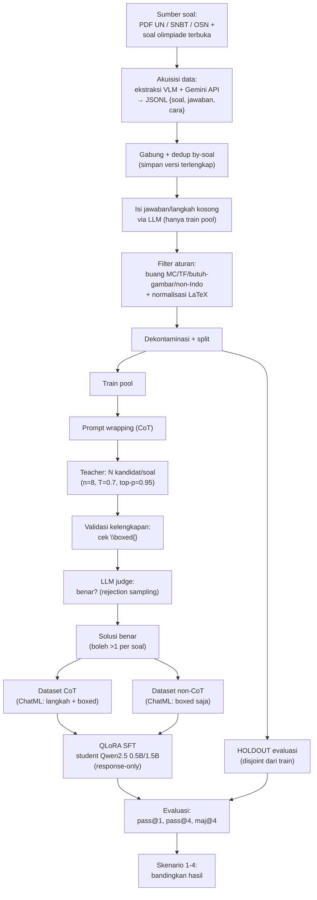

# PENGARUH CHAIN-OF-THOUGHT TERHADAP PENALARAN MATEMATIKA LLM
### Laporan Akhir — Final Project NLP, Kelompok 5

> **Status dokumen:** Bab I–III terisi. **Bab IV (Hasil dan Pembahasan)** dan **Bab V (Kesimpulan
> dan Saran)** ditunda sampai eksperimen selesai (placeholder berstruktur tersedia di bawah).
>
> **Tanda dalam dokumen:**
> `KONFIRMASI` = perlu dikonfirmasi ke anggota tim (terutama akuisisi data & teacher model).
> `VERIFIKASI SITASI` = field APA (halaman/DOI/venue) perlu dicek ulang ke sumber asli sebelum
> dikumpulkan — lihat catatan Daftar Pustaka.

---

## BAB I — PENDAHULUAN

### 1.1 Latar Belakang

Matematika merupakan salah satu kompetensi inti dalam sistem pendidikan Indonesia, dan kemampuannya
diuji secara berjenjang mulai dari asesmen di tingkat SMA, seleksi masuk perguruan tinggi (SNBT),
hingga kompetisi seperti Olimpiade Sains Nasional (OSN/KSN). Seiring berkembangnya model bahasa
besar (*Large Language Model*, LLM), model semacam ini mulai dipakai sebagai alat bantu belajar,
termasuk untuk menyelesaikan dan menjelaskan soal matematika. Sebagian besar pengembangan dan
evaluasi LLM untuk penalaran matematis sejauh ini berlangsung dalam Bahasa Inggris dan diukur pada
*benchmark* berbahasa Inggris (Hendrycks et al., 2021), sehingga capaiannya pada konteks dan bahasa
lain belum tentu setara.

Kemampuan penalaran matematis LLM diketahui meningkat ketika model didorong menuliskan langkah
penyelesaian secara eksplisit melalui *chain-of-thought* (CoT) (Wei et al., 2022; Kojima et al.,
2022). Namun efek ini umumnya teramati paling kuat pada model berukuran sangat besar (Wei et al.,
2022; Lewkowycz et al., 2022), yang mahal untuk dijalankan. Sebagai alternatif, sejumlah penelitian
menempuh jalur *knowledge distillation*, yaitu memindahkan kemampuan penalaran dari model besar ke
model yang lebih kecil dengan melatihnya pada jejak CoT yang dihasilkan model besar tersebut
(DeepSeek-AI et al., 2025). Untuk menjaga mutu data latih, jejak yang dihasilkan dapat disaring
melalui *rejection sampling* — hanya solusi yang formatnya lengkap dan jawabannya benar yang
dipakai — sebagaimana diterapkan pada dataset OpenMathReasoning dalam solusi pemenang AIMO-2
(Gitman et al., 2025). Sejauh mana pendekatan ini berhasil pada model yang **sangat** kecil masih
menjadi pertanyaan terbuka, karena model kecil memiliki kapasitas terbatas untuk menyerap pola
penalaran yang kompleks.

Pada konteks Bahasa Indonesia, persoalan bertambah. Model multibahasa seperti Qwen2.5 dapat
menyelesaikan sebagian soal matematika Indonesia secara *zero-shot*, tetapi kerap keliru pada
kosakata, struktur soal, maupun konvensi format jawaban kurikulum Indonesia. Di sisi lain, data
penalaran matematis berbahasa Indonesia yang berkualitas dan disertai solusi terverifikasi relatif
langka, sementara mayoritas dataset dan studi distilasi yang ada berbahasa Inggris (Toshniwal et
al., 2024; Gitman et al., 2025). Karena itu, belum jelas apakah resep distilasi-CoT yang efektif di
ranah Inggris dapat dipindahkan begitu saja ke Bahasa Indonesia dengan model berukuran kecil.

Berdasarkan permasalahan tersebut, penelitian ini menawarkan solusi berupa replikasi-skala-kecil
resep distilasi-CoT bergaya AIMO-2 untuk Bahasa Indonesia, yaitu mensintesis solusi penalaran
menggunakan *teacher model* yang disaring secara *rejection sampling*, kemudian memakainya untuk
melatih model *student* Qwen2.5 (0.5B/1.5B) secara hemat sumber daya dengan QLoRA, lalu
mengevaluasinya baik secara terkontrol — CoT dibandingkan non-CoT pada soal yang sama — maupun
terhadap model *baseline* tanpa *fine-tuning*. Keberhasilan pendekatan ini tidak diasumsikan sejak
awal; justru keterbatasan kapasitas model kecil dan kelangkaan data matematika berbahasa Indonesia
yang menjadikan pertanyaan ini layak diuji, sehingga penelitian ini sekaligus diharapkan
menghasilkan dataset dan *pipeline* yang dapat dimanfaatkan penelitian berikutnya.

### 1.2 Rumusan Masalah

1. Bagaimana membangun dataset soal matematika berbahasa Indonesia yang bersih dan bebas
   duplikasi melalui proses ekstraksi dan penyaringan?
2. Bagaimana menghasilkan solusi *Chain-of-Thought* (CoT) berkualitas tinggi untuk setiap soal
   menggunakan *teacher model*, dan seberapa besar proporsi solusi yang lolos validasi format
   maupun kebenaran jawaban?
3. Apakah *fine-tuning* model Qwen2.5 (0.5B/1.5B) menggunakan data CoT hasil distilasi dapat
   meningkatkan kemampuan penalaran matematika dalam Bahasa Indonesia dibandingkan model
   *baseline* tanpa *fine-tuning*?
4. Seberapa baik performa model hasil *fine-tuning* ketika dievaluasi pada metrik pass@1, pass@4,
   dan maj@4?

### 1.3 Tujuan Penelitian

1. Membangun dataset soal matematika berbahasa Indonesia yang bersih dan bebas duplikasi.
2. Menghasilkan pasangan soal–solusi *Chain-of-Thought* (CoT) terverifikasi sebagai data latih.
3. Melatih model Qwen2.5 (0.5B/1.5B) menggunakan data CoT yang dihasilkan dan mengukur
   peningkatan kemampuan penalaran matematika dalam Bahasa Indonesia dibandingkan *baseline*.
4. Membandingkan performa model sebelum dan sesudah *fine-tuning* pada metrik yang ditetapkan.

### 1.4 Manfaat Penelitian

**Manfaat Teoretis**
1. Memberikan kontribusi dataset soal matematika berbahasa Indonesia untuk penelitian selanjutnya.
2. Menambah pemahaman mengenai efektivitas *knowledge distillation* via CoT ketika diterapkan
   pada bahasa selain Inggris dengan model kecil.

**Manfaat Praktis**
1. Menghasilkan model berukuran kecil yang mampu menyelesaikan soal matematika berbahasa Indonesia.
2. Menyediakan *pipeline* yang dapat diadaptasi oleh peneliti lain untuk keperluan serupa.

### 1.5 Batasan Masalah

1. Domain soal dibatasi pada matematika tingkat SMA dan kompetisi (UN/SNBT/OSN serta soal bertipe
   olimpiade dari sumber terbuka).
2. Model *student* dibatasi pada keluarga Qwen2.5 ukuran kecil (0.5B dan 1.5B parameter) dengan
   *fine-tuning* hemat parameter (QLoRA).
3. *Teacher model* dan *judge* mengikuti ketersediaan komputasi (Bab III); kualitas distilasi
   dibatasi kapasitas *teacher* tersebut.
4. Evaluasi dilakukan pada *holdout* internal, bukan pada kompetisi atau *benchmark* eksternal
   berlisensi.

---

## BAB II — TINJAUAN PUSTAKA

### 2.1 Penelitian Terdahulu

#### 2.1.1 Chain-of-Thought Prompting Elicits Reasoning in Large Language Models (Wei dkk., 2022)
Wei dkk. (2022) memperkenalkan *chain-of-thought* (CoT) *prompting*, yaitu menyertakan contoh
*few-shot* yang memuat langkah penalaran antara sebelum jawaban akhir, sehingga model menalar
bertahap alih-alih memetakan soal langsung ke jawaban. Kontribusi utamanya: pada *benchmark*
aritmetika dan penalaran (antara lain GSM8K), CoT meningkatkan akurasi secara substansial, dan
peningkatan ini bersifat *emergent* — baru tampak nyata pada model berukuran sangat besar (sekitar
seratus miliar parameter ke atas) dan nyaris tak bermanfaat pada model kecil. **Relevansi:** menjadi
dasar format data latih dan templat *prompt* penelitian ini; sekaligus menyiratkan tantangan inti —
bagaimana memindahkan kemampuan yang lahir di model besar ke model *student* kecil.

#### 2.1.2 Large Language Models are Zero-Shot Reasoners (Kojima dkk., 2022)
Kojima dkk. (2022) menunjukkan CoT dapat dipicu tanpa contoh (*zero-shot*) hanya dengan menambahkan
instruksi sederhana semacam "*Let's think step by step*". Kontribusinya membuktikan kemampuan
penalaran bertahap dapat diaktifkan melalui instruksi minimal. **Relevansi:** menjadi dasar
perancangan templat instruksi berbahasa Indonesia yang meminta penyelesaian rinci tanpa bergantung
pada contoh *few-shot* yang mahal token.

#### 2.1.3 Self-Consistency Improves Chain of Thought Reasoning (Wang dkk., 2023)
Wang dkk. (2023) mengganti pemilihan keluaran *greedy* dengan strategi membangkitkan banyak jalur
penalaran melalui *sampling*, lalu memilih jawaban akhir melalui suara mayoritas. Untuk N sampel
dengan pasangan (jalur, jawaban) {(rᵢ, aᵢ)}, jawaban final dipilih sebagai
â = argmaxₐ Σᵢ 𝟙[aᵢ = a]. Kontribusinya menunjukkan marginalisasi atas beragam jalur penalaran
konsisten menaikkan akurasi dibanding satu jalur tunggal. **Relevansi:** menjadi dasar teoretis
metrik **maj@4** pada penelitian ini.

#### 2.1.4 Measuring Mathematical Problem Solving with the MATH Dataset (Hendrycks dkk., 2021)
Hendrycks dkk. (2021) merilis *benchmark* MATH berisi 12.500 soal matematika tingkat kompetisi yang
masing-masing dilengkapi solusi langkah-demi-langkah, serta menunjukkan model bahasa pada masa itu
masih jauh di bawah kemampuan manusia. Kontribusinya menyediakan tolok ukur penalaran dengan jawaban
terverifikasi. **Relevansi:** menjadi acuan desain evaluasi berjawaban terverifikasi dan motivasi
penggunaan pencocokan jawaban yang ketat.

#### 2.1.5 Solving Quantitative Reasoning Problems with Language Models — Minerva (Lewkowycz dkk., 2022)
Lewkowycz dkk. (2022) melatih-lanjut model bahasa besar pada korpus teknis dan matematis (Minerva)
dan mencapai performa kuat pada MATH serta soal STEM, sebagian dengan bantuan *majority voting*.
Kontribusinya menegaskan dua hal: pentingnya **data domain matematika** yang banyak dan manfaat
agregasi banyak sampel. **Relevansi:** mendukung argumen bahwa pelatihan *on-domain* (data
matematika) dan voting (maj@k) relevan untuk meningkatkan penalaran — meski penelitian ini bekerja
pada skala model jauh lebih kecil.

#### 2.1.6 DeepSeek-R1: Incentivizing Reasoning Capability in LLMs via RL (DeepSeek-AI dkk., 2025)
DeepSeek-AI dkk. (2025) membangun kemampuan penalaran melalui *reinforcement learning*, lalu
**mendistilasi** kemampuan tersebut ke model *dense* yang lebih kecil (keluarga Qwen dan Llama)
dengan melatihnya pada jejak penalaran model besar. Kontribusinya memberi bukti empiris bahwa
penalaran dapat ditransfer ke model kecil via data CoT. **Relevansi:** menjadi landasan kelayakan
distilasi-ke-model-kecil dan rujukan pemilihan keluarga *teacher* berbasis R1.

#### 2.1.7 AIMO-2 Winning Solution / OpenMathReasoning (Gitman dkk., 2025) — *rujukan utama*
Gitman dkk. (2025) menyusun dataset OpenMathReasoning dan resep pemenang kompetisi AIMO-2: untuk tiap
soal dibangkitkan banyak kandidat solusi CoT oleh *teacher* penalaran kuat, lalu disaring menjadi
solusi yang benar (*rejection sampling*), dilengkapi solusi *tool-integrated* dan mekanisme pemilihan
solusi (GenSelect). VERIFIKASI Skala dataset dilaporkan ratusan ribu soal unik dengan jutaan jejak
CoT (≈540 ribu soal; ≈3,2 juta solusi CoT — angka dari dokumentasi `pipeline.md`/kartu dataset,
perlu diverifikasi ke sumber). Kontribusinya menjadi resep mutakhir pembentukan data penalaran
matematika berskala besar. **Relevansi:** menjadi **resep utama yang direplikasi** penelitian ini,
diturunkan ke skala kecil dan konteks Bahasa Indonesia. *(Catatan: rujukan ini berupa technical
report/preprint — lihat Daftar Pustaka.)*

#### 2.1.8 OpenMathInstruct-1 (Toshniwal dkk., 2024)
Toshniwal dkk. (2024) menyusun dataset penyetelan instruksi matematika berskala 1,8 juta contoh
dengan membangkitkan solusi dari model terbuka lalu menyaringnya berdasarkan kebenaran jawaban.
**Relevansi:** contoh konkret pembentukan data latih matematika via *generate-then-filter* yang
menjadi pola dasar tahap sintesis CoT penelitian ini. † (venue/tahun perlu dikonfirmasi.)

#### 2.1.9 Sintesis: Posisi Penelitian
Karya-karya di atas menetapkan tiga fondasi — CoT sebagai mekanisme penalaran (2.1.1–2.1.3),
distilasi/penyaringan sebagai cara membentuk data (2.1.6–2.1.8), dan evaluasi berjawaban
terverifikasi (2.1.4–2.1.5) — namun seluruhnya berpusat pada Bahasa Inggris dan, untuk efek CoT,
pada model besar. Belum ada yang menelaah penerapan resep ini pada **Bahasa Indonesia** dengan
**model *student* sangat kecil (0.5B/1.5B)** sekaligus **membandingkan CoT vs non-CoT secara
terkontrol**. Celah inilah yang diisi penelitian ini.

### 2.2 Landasan Teori

#### 2.2.1 Model Bahasa Besar dan Keluarga Qwen2.5
Model bahasa besar (*Large Language Model*, LLM) adalah model autoregresif berbasis arsitektur
Transformer yang dilatih memaksimalkan peluang token berikutnya pada korpus teks masif. Setelah
prapelatihan, kemampuan lintas-tugas muncul tanpa pelatihan khusus per-tugas. Penelitian ini memakai
keluarga Qwen2.5 — model *decoder-only* yang tersedia *open-weight* pada beberapa skala, termasuk
0,5 miliar dan 1,5 miliar parameter — sebagai model *baseline* maupun *student*. Skala kecil ini
dapat dilatih pada GPU bermemori terbatas dan menjadikan model praktis untuk penerapan lokal, namun
sekaligus berkapasitas terbatas dalam menyerap pola penalaran panjang — ketegangan yang justru
diuji penelitian ini. Format percakapan ChatML yang dipakai Qwen memisahkan giliran *user* dan
*assistant* secara eksplisit, sehingga memudahkan pelatihan dengan *loss* yang dimasking hanya pada
giliran jawaban (lihat 2.2.5).

#### 2.2.2 Penalaran Chain-of-Thought dan Self-Consistency
*Chain-of-thought* adalah representasi penalaran sebagai barisan langkah antara z = (z₁, …, z_m)
yang dihasilkan model sebelum jawaban akhir a, alih-alih memetakan soal x langsung ke a. Dengan
membiarkan model "menalar dengan menulis", komputasi terdistribusi sepanjang langkah dan
ketergantungan antar-langkah dapat dimodelkan secara eksplisit (Wei dkk., 2022; Kojima dkk., 2022).
Penelitian ini menstandarkan jawaban akhir ke dalam penanda `\boxed{…}` agar dapat diekstraksi dan
dinilai secara otomatis dari teks penalaran yang panjang. Karena satu jalur penalaran tunggal rapuh
terhadap kesalahan, *self-consistency* (Wang dkk., 2023) membangkitkan beberapa jalur lalu memungut
jawaban mayoritas; prinsip ini dioperasionalkan sebagai metrik maj@4 (lihat 2.2.6). Perlu dicatat,
manfaat CoT pada model kecil tidak dijamin sebesar pada model besar (Wei dkk., 2022) — sebuah
batasan yang relevan langsung dengan setelan penelitian ini.

#### 2.2.3 Knowledge Distillation dan Rejection Sampling
*Knowledge distillation* memindahkan kemampuan dari model *teacher* berkapasitas besar ke model
*student* yang lebih kecil. Pada penalaran matematika, bentuk yang dipakai bukan penyelarasan
distribusi keluaran, melainkan **distilasi berbasis data**: *teacher* membangkitkan k kandidat solusi
CoT per soal, lalu hasilnya disaring (DeepSeek-AI dkk., 2025; Gitman dkk., 2025). Penyaringan
mengikuti prinsip *rejection sampling* — sebuah kandidat dipertahankan hanya bila (i) lengkap secara
format (memuat `\boxed{}`) dan (ii) jawaban akhirnya terverifikasi benar terhadap kunci. Dengan
demikian, dari banyak kandidat yang mungkin keliru, hanya jejak penalaran yang sampai ke jawaban
benar yang menjadi data latih. Pendekatan ini menukar volume data dengan keandalan label: ia menuntut
banyak pembangkitan oleh *teacher*, tetapi menjamin *student* belajar dari solusi yang benar meskipun
*teacher* tidak sempurna. Konsekuensinya, **laju penerimaan** (proporsi kandidat lolos) menjadi
indikator penting kualitas *teacher* dan kelayakan jumlah kandidat per soal.

Verifikasi kebenaran pada tahap penyaringan tidak selalu dapat dilakukan secara otomatis. Pada
dataset penelitian ini, kunci jawaban kerap berupa kalimat berbahasa Indonesia tanpa penanda
`\boxed`, sehingga pencocokan string maupun simbolik (SymPy) menjadi tidak andal. Untuk mengatasinya
dipakai pendekatan **LLM sebagai penilai (*LLM-as-a-judge*)**, yaitu memanfaatkan sebuah LLM untuk
memutuskan apakah jawaban prediksi *teacher* ekuivalen secara nilai dengan kunci jawaban (Zheng, L.,
dkk., 2023). LLM penilai diberi soal, kunci jawaban, dan jawaban prediksi, lalu diminta memberi
keputusan biner ("benar"/"salah") pada suhu nol agar deterministik. Pendekatan ini lebih luwes
terhadap variasi penulisan jawaban dibanding pencocokan kaku, tetapi keandalannya bergantung pada
kapasitas LLM penilai dan rumusan *prompt* penilaian sehingga keputusannya tetap perlu di-*sanity-
check*. VERIFIKASI SITASI Zheng, L., dkk. (2023) di sini merujuk karya MT-Bench/Chatbot Arena —
**berbeda** dari Zheng, M., dkk. (2023) tentang CoT tabular; lihat Daftar Pustaka.

#### 2.2.4 Parameter-Efficient Fine-Tuning: LoRA dan QLoRA
*Fine-tuning* penuh memperbarui seluruh bobot model dan menuntut memori sebesar model itu sendiri
ditambah status optimizer-nya. *Low-Rank Adaptation* (LoRA; Hu dkk., 2022) berangkat dari hipotesis
bahwa pembaruan bobot selama adaptasi memiliki *rank* intrinsik rendah, sehingga untuk bobot dasar
W₀ ∈ ℝ^{d×k} yang **dibekukan**, pembaruannya dipodelkan sebagai hasil kali dua matriks beradik-rendah:

  W = W₀ + ΔW = W₀ + B·A,  dengan B ∈ ℝ^{d×r}, A ∈ ℝ^{r×k}, r ≪ min(d, k).

Hanya A dan B yang dilatih, sehingga jumlah parameter terlatih turun dari d·k menjadi r·(d+k);
kontribusi adapter biasanya diskalakan faktor α/r. *QLoRA* (Dettmers dkk., 2023) melangkah lebih jauh
dengan mengkuantisasi W₀ ke presisi 4-bit *NormalFloat* (NF4) — tipe data yang optimal untuk bobot
berdistribusi mendekati normal — sambil tetap melatih adapter LoRA pada presisi lebih tinggi,
ditambah *double quantization* dan *paged optimizers* untuk menekan lonjakan memori. Gabungan ini
memungkinkan *fine-tuning* model besar pada satu GPU bermemori terbatas tanpa penurunan kualitas yang
berarti. Penelitian ini memakai QLoRA agar pelatihan *student* layak dijalankan pada GPU kelas
Kaggle T4.

#### 2.2.5 Supervised Fine-Tuning dan Response-Only Masking
*Supervised fine-tuning* (SFT) melatih model meniru pasangan instruksi–jawaban berlabel, lazim
sebagai tahap penyetelan instruksi (Ouyang dkk., 2022). Pada format ChatML, satu contoh terdiri atas
giliran *user* (soal beserta instruksi) dan *assistant* (solusi target). *Loss* dapat dihitung hanya
pada token giliran *assistant* (*response-only masking*) sehingga model belajar **menghasilkan
jawaban**, bukan menghafal *prompt*. Hal ini penting bagi desain eksperimen: dengan model dasar dan
hiperparameter dipertahankan identik dan **hanya** target jawaban yang divariasikan — berlangkah
(CoT) versus ringkas (non-CoT) — selisih performa yang teramati dapat diatribusikan pada keberadaan
penalaran eksplisit, bukan pada faktor lain.

#### 2.2.6 Evaluasi Penalaran dan Metrik pass@k / maj@k
Evaluasi penalaran matematis menuntut jawaban yang dapat diverifikasi (Hendrycks dkk., 2021;
Lewkowycz dkk., 2022). Tiga metrik dipakai: **pass@1**, yaitu proporsi soal yang benar pada satu
sampel (dekode *greedy*); **pass@k**, yaitu proporsi soal yang benar pada setidaknya satu dari k
sampel — mengukur kemampuan model menemukan solusi bila diberi beberapa percobaan; dan **maj@k**,
yaitu proporsi soal yang benar berdasarkan jawaban mayoritas dari k sampel — operasionalisasi
*self-consistency* (Wang dkk., 2023) yang lebih ketat daripada pass@k karena menuntut konsistensi,
bukan sekadar keberuntungan satu sampel. Karena dua jawaban dapat ekuivalen secara nilai meski
berbeda penulisan (misalnya 0,5 dan 1/2, atau 2x dan x·2), penilaian kebenaran dilakukan bertingkat:
pencocokan **eksak**, lalu **numerik** (toleransi galat), lalu **simbolik** menggunakan sistem aljabar
komputer (SymPy). Pencocokan string semata akan salah-vonis banyak jawaban yang sebenarnya benar.

---

## BAB III — METODOLOGI PENELITIAN

### 3.1 Alur Sistem (Flowchart)

Penelitian mengikuti lima tahap berurutan. Diagram alur sistem secara keseluruhan disajikan pada
Gambar 3.1 (versi gambar tersedia pada berkas `pipeline.jpeg`; versi diagram berikut dapat dirender
langsung):

**Gambar 3.1** Alur sistem penelitian.

### 3.2 Akuisisi Data
Soal dikumpulkan dari ujian dan kompetisi matematika Indonesia (UN/SNBT, OSN) serta sumber soal
matematika terbuka berskala besar. KONFIRMASI Berbeda dari rencana awal yang mengandalkan *web
scraping*, ekstraksi dari berkas PDF dilakukan menggunakan **Vision-Language Model (VLM) dengan
Gemini API**, karena *scraping* langsung kurang andal untuk tata letak PDF dan notasi matematika.
**Masukan:** berkas PDF/halaman soal. **Keluaran:** JSONL `{"soal","jawaban","cara"}` dengan notasi
matematika dinormalisasi ke LaTeX. *(Detail teknis dikerjakan anggota tim dan akan dikonfirmasi.)*

### 3.3 Preprocessing
Tahap penyaringan deterministik dan murah (mengikuti `LAPORAN_PROGRES.md`), dengan tujuan menjaga
hanya soal yang lengkap, berbahasa Indonesia, dan berjawaban terverifikasi:
1. **Penggabungan & deduplikasi** — dedup berbasis teks soal; saat ada kembaran disimpan versi
   paling lengkap (prioritas: ada jawaban > ada langkah > langkah terpanjang).
2. **Pengisian jawaban/langkah kosong** — memakai LLM, **hanya** untuk *train pool*, **tidak** untuk
   kunci *holdout*, demi menjaga integritas *benchmark*.
3. **Penyaringan berbasis aturan** — membuang soal pilihan ganda, benar/salah, soal yang memerlukan
   gambar/tabel hilang, dan soal non-Indonesia (deteksi bahasa); normalisasi LaTeX.
4. **Dekontaminasi & pemisahan** — memisahkan *holdout* evaluasi dari *train pool* dan memastikan
   keduanya **disjoint** agar tidak terjadi kebocoran data (*data leakage*). Statistik tiap tahap
   dilaporkan pada Bab IV.

### 3.4 Sintesis *Chain-of-Thought* (Distilasi)
1. **Prompt wrapping** — tiap soal dibungkus templat instruksi berbahasa Indonesia yang meminta
   penyelesaian rinci dengan jawaban akhir di `\boxed{}`.
2. **Pembangkitan kandidat** — *teacher* membangkitkan beberapa kandidat solusi per soal (*n*=8,
   *temperature*=0.7, *top-p*=0.95) untuk keberagaman jalur, mengikuti resep AIMO-2. KONFIRMASI
   *Teacher* menyesuaikan ketersediaan layanan: rencana awal DeepSeek-R1-Distill-Qwen-7B,
   implementasi berjalan pada model penalaran kuat via *endpoint* daring kompatibel OpenAI maupun
   *backend* vLLM pada GPU.
3. **Validasi kelengkapan** — kandidat tanpa `\boxed{}` dibuang (penalaran terpotong/format rusak).
4. **Validasi kebenaran (*rejection sampling*)** — karena kunci jawaban berupa kalimat natural tanpa
   `\boxed`, kebenaran diputuskan oleh **LLM judge** yang menilai kesetaraan nilai jawaban prediksi
   terhadap kunci ("benar"/"salah").
5. **Penyimpanan** — seluruh kandidat benar dipertahankan (boleh >1 solusi per soal).

### 3.5 Konstruksi Data SFT (CoT vs non-CoT)
Dari kumpulan solusi benar yang sama dibentuk dua dataset ChatML:
- **CoT** — *user*: prompt minta langkah; *assistant*: penalaran penuh diakhiri `\boxed{jawaban}`.
- **non-CoT** — *user*: prompt minta jawaban saja; *assistant*: `\boxed{jawaban}` tanpa langkah.

Dengan menahan model dasar dan hiperparameter tetap dan **hanya** memvariasikan dataset ini, efek
CoT dapat diisolasi. *Loss* dihitung hanya pada token *assistant* (*response-only masking*).

### 3.6 Pelatihan (QLoRA SFT)
QLoRA (4-bit NF4) dengan konfigurasi (mengikuti `src/training/configs/`): model dasar
Qwen2.5-0.5B/1.5B; LoRA *r*=16, *alpha*=32, *dropout*=0.05; *target modules*
q/k/v/o/gate/up/down; *epochs*=2; *batch size*=2 × *gradient accumulation*=8;
*learning rate*=2×10⁻⁴; *scheduler* kosinus; *max sequence length*=4096. Tiap konfigurasi
menghasilkan satu adaptor LoRA; pasangan CoT/non-CoT dilatih dengan hiperparameter identik.

### 3.7 Skenario Eksperimen
1. **Skenario 1** — perbandingan metode *preprocessing* dataset terbaik.
2. **Skenario 2** — perbandingan metode sintesis CoT.
3. **Skenario 3** — perbandingan hasil model CoT vs non-CoT.
4. **Skenario 4** — perbandingan terhadap model yang **tidak** di-*fine-tune* (*baseline zero-shot*).

### 3.8 Evaluasi dan Metrik
Model dievaluasi pada *holdout* internal dengan metrik **pass@1, pass@4, maj@4**. Penilaian
kebenaran memakai ekstraksi `\boxed{}` dan pencocokan berlapis (eksak → numerik → simbolik dengan
SymPy), dengan *fallback* mengambil angka terakhir bila format `\boxed` tak dipatuhi. *Holdout*
untuk menilai model hasil *fine-tuning* **wajib disjoint** dari data latih; *holdout* yang
mengandung kebocoran hanya layak untuk menilai *baseline* yang tidak dilatih pada data tersebut.

### 3.9 Perangkat Penelitian
GPU Kaggle T4 dan GPU lokal kelas RTX 30/40/50-series (VRAM 6–8 GB, RAM 12–32 GB). *Stack*: PyTorch,
Transformers, PEFT, bitsandbytes, TRL; sintesis CoT memakai vLLM (mode GPU) atau *endpoint* daring
kompatibel OpenAI (mode API).

---

## BAB IV — HASIL DAN PEMBAHASAN

> **DITUNDA** Diisi setelah eksperimen selesai. Kerangka:
> 4.1 Statistik dataset tiap tahap pipeline · 4.2 Hasil sintesis CoT (proporsi lolos validasi —
> menjawab RQ-2) · 4.3 Skenario 1 (preprocessing) · 4.4 Skenario 2 (metode CoT) · 4.5 Skenario 3
> (CoT vs non-CoT: pass@1/4, maj@4) · 4.6 Skenario 4 (baseline zero-shot) · 4.7 Analisis kesalahan ·
> 4.8 Pembahasan terhadap rumusan masalah.

---

## BAB V — KESIMPULAN DAN SARAN

> **DITUNDA** Diisi setelah Bab IV. Kerangka: 5.1 Kesimpulan (menjawab tiap rumusan masalah);
> 5.2 Saran (kualitas data, skala teacher, benchmark diskriminatif, pengembangan lanjut).

---

## DAFTAR PUSTAKA

> Format: **APA edisi ke-7**. VERIFIKASI SITASI — entri disusun dari referensi PPT kelompok dan
> rujukan metodologi standar di bidang ini. Semua karya berikut **nyata** dan terbit ≥ 2021 di venue
> *peer-reviewed* (NeurIPS/ICLR/EMNLP/Nature), **kecuali** Gitman et al. (2025) yang merupakan
> *technical report* (preprint) — dipertahankan sebagai rujukan utama atas penjelasan ke dosen.
> Karena field detail (nomor halaman/DOI/nomor volume) tidak dapat diverifikasi otomatis di sini,
> **cek ulang setiap entri ke sumber asli** sebelum dikumpulkan. Entri bertanda † perlu konfirmasi
> venue/tahun.

DeepSeek-AI, Guo, D., Yang, D., Zhang, H., et al. (2025). DeepSeek-R1: Incentivizing reasoning
capability in LLMs via reinforcement learning. *Nature*. https://doi.org/10.1038/s41586-025-09422-z

Dettmers, T., Pagnoni, A., Holtzman, A., & Zettlemoyer, L. (2023). QLoRA: Efficient finetuning of
quantized LLMs. In *Advances in Neural Information Processing Systems (NeurIPS 2023)*.

Gitman, I., et al. (2025). *AIMO-2 winning solution: Building state-of-the-art mathematical
reasoning models with the OpenMathReasoning dataset* [Technical report]. arXiv:2504.16891.
Preprint — konfirmasi penggunaan ke dosen.

Hendrycks, D., Burns, C., Kadavath, S., Arora, A., Basart, S., Tang, E., Song, D., & Steinhardt, J.
(2021). Measuring mathematical problem solving with the MATH dataset. In *Proceedings of the Neural
Information Processing Systems Track on Datasets and Benchmarks (NeurIPS 2021)*.

Hu, E. J., Shen, Y., Wallis, P., Allen-Zhu, Z., Li, Y., Wang, S., Wang, L., & Chen, W. (2022). LoRA:
Low-rank adaptation of large language models. In *International Conference on Learning
Representations (ICLR 2022)*.

Kim, Jb., Kim, H., Hahn, J., & Han, Y.-S. (2023). ATHENA: Mathematical reasoning with thought
expansion. In *Proceedings of the 2023 Conference on Empirical Methods in Natural Language
Processing (EMNLP 2023)* (pp. 16315–16327). Association for Computational Linguistics.

Kojima, T., Gu, S. S., Reid, M., Matsuo, Y., & Iwasawa, Y. (2022). Large language models are
zero-shot reasoners. In *Advances in Neural Information Processing Systems (NeurIPS 2022)*.

Lewkowycz, A., Andreassen, A., Dohan, D., Dyer, E., Michalewski, H., Ramasesh, V., Slone, A., Anil,
C., Schlag, I., Gutman-Solo, T., Wu, Y., Neyshabur, B., Gur-Ari, G., & Misra, V. (2022). Solving
quantitative reasoning problems with language models. In *Advances in Neural Information Processing
Systems (NeurIPS 2022)*.

Ouyang, L., Wu, J., Jiang, X., Almeida, D., Wainwright, C., Mishkin, P., Zhang, C., Agarwal, S.,
Slama, K., Ray, A., et al. (2022). Training language models to follow instructions with human
feedback. In *Advances in Neural Information Processing Systems (NeurIPS 2022)*.

† Toshniwal, S., Moshkov, I., Narenthiran, S., Gitman, D., Jia, F., & Gitman, I. (2024).
OpenMathInstruct-1: A 1.8 million math instruction tuning dataset. In *Advances in Neural
Information Processing Systems, Datasets and Benchmarks Track (NeurIPS 2024)*.

Wang, X., Wei, J., Schuurmans, D., Le, Q., Chi, E., Narang, S., Chowdhery, A., & Zhou, D. (2023).
Self-consistency improves chain of thought reasoning in language models. In *International
Conference on Learning Representations (ICLR 2023)*.

Wei, J., Wang, X., Schuurmans, D., Bosma, M., Ichter, B., Xia, F., Chi, E., Le, Q. V., & Zhou, D.
(2022). Chain-of-thought prompting elicits reasoning in large language models. In *Advances in
Neural Information Processing Systems* (Vol. 35, pp. 24824–24837).

† Zheng, L., Chiang, W.-L., Sheng, Y., Zhuang, S., Wu, Z., Zhuang, Y., Lin, Z., Li, Z., Li, D., Xing,
E. P., Zhang, H., Gonzalez, J. E., & Stoica, I. (2023). Judging LLM-as-a-judge with MT-Bench and
Chatbot Arena. In *Advances in Neural Information Processing Systems, Datasets and Benchmarks Track
(NeurIPS 2023)*. (Berbeda dari Zheng, M., dkk., 2023.)

Zheng, M., Yang, H., Jiang, W., Lin, Z., Lyu, Y., She, Q., & Wang, W. (2023). Chain-of-thought
reasoning in tabular language models. In *Findings of the Association for Computational Linguistics:
EMNLP 2023* (pp. 11006–11019). Association for Computational Linguistics.

Zhou, D., Schärli, N., Hou, L., Wei, J., Scales, N., Wang, X., Schuurmans, D., Cui, C., Bousquet, O.,
Le, Q., & Chi, E. (2023). Least-to-most prompting enables complex reasoning in large language
models. In *International Conference on Learning Representations (ICLR 2023)*.
